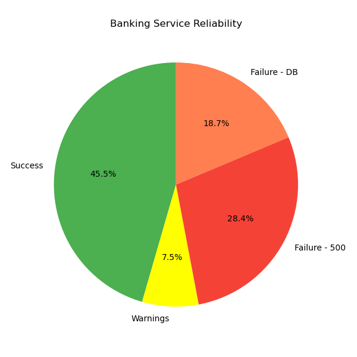

# Bank Service Reliability Assessment

### 📖 Overview

This project automates the evaluation of a distributed banking API’s reliability by repeatedly invoking the service, analyzing its logs, and visualizing results. The goal is to measure how often the service responds successfully versus returning errors or warnings.


### 🏦 Problem Statement

A local bank has deployed a new API to provide account balances:
🔗 [Get Balance Endpoint](https://latest-960957615762.me-central1.run.app/getbalance)

The API occasionally returns errors. Its behavior is logged at:
🔗 [Get Logs Endpoint](https://latest-960957615762.me-central1.run.app/getlogs)

We are doing:

1. Invoke the banking API about **100 times**.
2. Download and parse the **log file** to count various outcomes.
3. Visualize and discuss the system’s **reliability**.


### ⚙️ Implementation Details

The Python script automates all stages of the task:

1. **Invoke Requests** – Sends 100 API calls to the `/getbalance` endpoint, recording HTTP status codes.
2. **Fetch Logs** – Downloads the latest service logs from `/getlogs`.
3. **Parse Logs** – Counts occurrences of:

   * ✅ Successful responses
   * ❌ Internal Server Errors (500)
   * ❌ Database Connection Pool Empty
   * ⚠️ Server Latency Warnings
4. **Generate Output Files:**

   * `results.csv`: Summary of all metrics
   * `reliability.png`: Pie chart visualizing reliability distribution
5. **Print Reliability Report** – Shows total requests, failures, and calculated reliability percentage.

### 📊 Example Output

**Console Report:**

```
[3/3] RELIABILITY REPORT
Total logged requests:     109
Successful responses:      61 (56.0%)
Failures (500 errors):     10
Failures (DB pool empty):  38
Warnings:                  25
Total failures:            48
Results saved to results.csv
Chart saved to reliability.png
Automation complete!
```

**Reliability Pie Chart:**

* Green – Success
* Yellow – Warnings
* Red/Orange – Failure Types

<p align="left">  </p>

### 🧪 Files Included

| File                   | Description                                                              |
| ---------------------- | ------------------------------------------------------------------------ |
| `banking_test.py` | Main Python script performing all automation steps                       |
| `results.csv`          | Generated results summary (successes, failures, warnings, reliability %) |
| `reliability.png`      | Visualization of reliability distribution                                |
| `README.md`            | Documentation of the assignment                                          |

---

### 🧠 Tools & Libraries Used

* **Python 3**
* **requests** – for API interaction
* **matplotlib** – for visualization
* **csv** & **time** – for data handling and pacing requests

### 📈 Summary of Findings

* The system achieved approximately **56% reliability**.
* Frequent failures were caused by **database connection pool exhaustion**.
* Despite intermittent success, the service requires **infrastructure scaling** or **connection pool optimization** to improve consistency.
